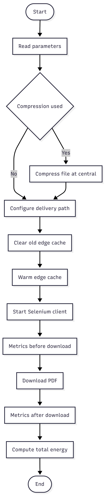

# Use Case 2: Optimal Compression and Decompression Placement in CDN

This subpackage evaluates the ecological efficiency of compression/decompression strategies for delivering scientific PDFs in a university digital library CDN.

### Strategies Compared
1. **No compression**  
   Files stored/served uncompressed everywhere. Client receives raw file (zero decompression).

2. **Compression on central → Decompression on edge**  
   Central pre-compresses once (Gzip/Brotli). Edge stores compressed version, decompresses on cache hit before sending raw to client.

3. **Compression on central → Decompression on client**  
   Central pre-compresses. Edge stores/serves compressed payload. Client browser decompresses.

### Energy Footprint Breakdown
- **One-time central compression** (amortized over requests).
- **Edge decompression** (strategy 2 only, per cache hit).
- **Network transmission** (central → edge + edge → client, proportional to bytes transferred).
- **Client decompression** (strategy 3 only).

### Simulation Flow (via /usecase2/start endpoint)

The endpoint orchestrates a complete single-run experiment with the following sequential steps:

  

### Selenium Script Mechanics (run_selenium.py)
- **Headless Chrome** via Selenium Remote (localhost:4444).
- **Fetch PDF** using JS `fetch().arrayBuffer()` (measures full fetch + decode time).
- **Parse CDP performance logs**: Extract encoded/decoded sizes, transfer times, Content-Encoding.
- **Fallback**: Use `performance.getEntriesByType('resource')`.
- **Metrics**: Transfer size, decoded size, compression ratio, network time, client decompress time (total - network), PDF processing duration.
- **Sleep 15s** at end: Ensures Prometheus/logporter/cAdvisor captures accurate CPU/network counters.
- **Screenshot**: Saved to `/tmp/book_screenshot.png` for verification.

### Key Components
- **Central-manager API**: `/usecase2/start` (accepts strategy, algo, level, file).
- **Selenium container**: Headless Chrome for realistic browser decompression.
- **Metrics**: Prometheus gauges for central/edge/client energy, sizes, times.
- **Output**: Single-run result with detailed breakdown saved in central-nginx container by this path `/var/log/central/uc2_runs.jsonl` (JSONL format).

This use case identifies the greenest strategy by minimizing total energy across compression, decompression, and network transfer for PDF delivery.
